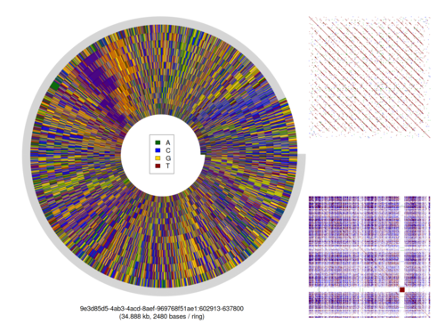

# Repeat Spiral Plot

A tutorial by David Eccles about representing a repetitive DNA sequence in a visually-interesting form. This tutorial uses data from the [nanopore WGS consortium](https://github.com/nanopore-wgs-consortium/) and describes a process for generating an image similar to the following:

## Accessory scripts

* [Repeat finder](https://github.com/gringer/bioinfscripts/blob/master/fastx-rlength.pl)
* [Spiral-generating R script](https://github.com/gringer/bioinfscripts/blob/master/seqmat.r)
* [Kmer dotplots](https://github.com/gringer/bioinfscripts/blob/master/fastx-kdotplot.pl)

## Process

1. Download sequence data
2. Troll for repetitive regions
3. Identify repetitive subsequence
4. Generate spiral plot
5. Generate kmer dotplots
6. Create montage using GIMP

## Background

### DNA From a Tomato Source

I call DNA the recipe book of the living world. Every living thing has
DNA in it; it codes for the things our bodies make, and tells the
cells in our bodies what to do and where to go.

To extract DNA from many things, you can grind them up in a mortar and
pestle, add a bit of water, let it drip through a filter, then add a
bit of alcohol.

This here is not just DNA, because there are some tomato-ey proteins
that stuck to it as it was drained through the tea strainer, but it
gives you an idea of what DNA looks like: long, stringy white stuff
that has an amazing ability to clump together with itself.

[image: DNA from a tomato]

When DNA is represented at an atomic level, we see that it is
composed of four different nitrogenous bases: double and single carbon
rings that are supported by a sugar/phosphate backbone.

Each of these bases can be represented symbolically as one of 4
letters: A, C, G and T. When combined into a string of sequential
letters, we call it a DNA sequence.

The process of converting from the physical thing of DNA into a model
on a computer is called DNA sequencing.

[image: DNA sequence]

### Sequencing DNA by Shape

Imagine there is a device that can scan across an image of DNA, like a
photocopier, and work out how much black there is in each line of the
image. What you end up with is a squashed down representation of the
DNA, showing how much stuff there is at a particular place in the
DNA.

If our line detector were sensitive enough, then we would be able to
distinguish the four different bases just on this profile alone. A and
G look similar, as do C and T. Similar, but a well-trained eye would
be able to tell the difference.

[image: comparison of Sanger vs Nanopore sequencing]

### Sequencing DNA by Nanopore

The MinION contains a consumable flow cell, which has a commercial
cost of about \$1300. This flow cell has thousands of small sequencing
pools, each which has a waterproof cover over the top. This cover is
pierced by protein tunnels, which we call nanopores.

An electric current is hooked up to the flow cell, which encourages
DNA to move through the nanopores. Similar to the picture I showed
previously, the shape of the DNA changes along its length, and this
changes the electrical resistance. The change in resistance is
recorded by the sequencer and sent to a computer over a USB cable.

This sequencer is very portable: all it needs is some prepared DNA,
and a little bit of electricity.

[image: nanopore diagram]

### Nanoscopes and Wide-angle Lenses

Because the MinION sequences DNA by looking at it, it can show you
things beyond what you could see from just knowing the A/C/G/T
sequence.

Some features of prepared DNA can only be seen by looking at the electrical signal created by the MinION. It's able to see chemical changes at a sub-base level, changes on the scale of a few nanometres. We have studied nanopore sequences at the electrical signal level for investigating whether there were epigenetic signals in unamplified mitochondrial DNA [1]. We have also used a signal-level analysis to distinguish between DNA sequences that were joined *in-vitro* during sample preparation and sequences that were joined *in-silico* by the base caller [2].

[image: chimeric reads]

And yet, at the other end of the scale, the MinION doesn't limit the
length of the DNA that is put into it. You can use this feature to
look at repetitive structures, and maybe they're not exactly
repetitive after all, having more complex patterns, only visible when
looking at the big picture.

When I use this device, I get glimpses like these about what might be
missing in our knowledge of DNA, and I get really excited by that.

[image: nippo repeat region, showing spiral pattern]

## References

[1] https://f1000research.com/articles/6-56/v1

[2] https://f1000research.com/articles/6-631/v2